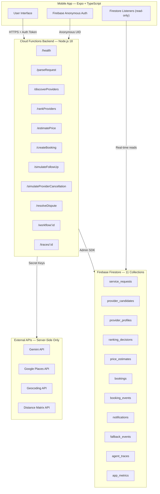

# KaamWala AI — Real Working MVP Architecture

**Last Updated:** 2026-05-16 | **Version:** 3.0

---

## Core Principle

> **No secrets in mobile app. No fake bookings. No spam. Backend owns all external APIs.**

---

## System Architecture



---

## Data Flow

```
User types request (Urdu/English/Mixed)
  └→ Mobile calls POST /parseRequest
       └→ Backend calls Gemini API (server-side)
       └→ Stores in service_requests, logs UNDERSTAND trace
       └→ Returns parsed intent to mobile

  └→ Mobile calls POST /discoverProviders
       └→ Backend calls Geocoding + Places + Distance Matrix
       └→ Merges with registered provider_profiles
       └→ Stores in provider_candidates, logs OBSERVE trace
       └→ Returns candidate list

  └→ Mobile calls POST /rankProviders
       └→ Backend calls Gemini for multi-factor ranking
       └→ Flags registered vs unregistered
       └→ Stores in ranking_decisions, logs REASON + DECIDE traces
       └→ Returns ranked list

  └→ Mobile calls POST /estimatePrice
       └→ Backend calls Gemini for contextual pricing
       └→ Stores in price_estimates, logs DECIDE trace
       └→ Returns price range + factors

  └→ User selects REGISTERED provider → POST /createBooking
       └→ Backend verifies provider in provider_profiles
       └→ Creates booking in Firestore, logs ACT trace
       └→ Returns booking confirmation

  └→ Mobile calls POST /simulateFollowUp
       └→ Backend creates notification record + timeline
       └→ Stores in notifications + booking_events, logs EVALUATE trace

  └→ POST /simulateProviderCancellation (demo)
       └→ Backend cancels booking, re-ranks, rebooks fallback
       └→ Stores in fallback_events, logs RECOVER trace

  └→ GET /traces/:workflowId
       └→ Returns full 7-step agent decision trail
```

---

## Security Boundaries

| Layer | Has Access To | Does NOT Have |
|-------|--------------|---------------|
| **Mobile App** | Firebase public config, Auth UID, Firestore reads, backend URL | Gemini key, Maps key, service account, Admin SDK |
| **Backend** | Gemini key, Maps key, Admin SDK, Firestore read/write | — |
| **Firestore Rules** | Auth-gated reads for user-owned data | Public writes (all writes via Admin SDK) |

---

## Provider Booking Rules

| Provider Source | Bookable? | UI Label |
|----------------|-----------|----------|
| Registered in `provider_profiles` | ✅ Yes | **"Book Now"** |
| Google Places only | ❌ No | **"Discovered — onboarding required"** |
| Registered + Google Places match | ✅ Yes | **"Verified KaamWala Provider"** |
