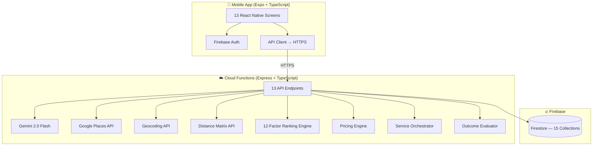

# KaamWala AI

> **Agentic AI Service Orchestrator for Pakistan's Informal Economy**

**Challenge:** #AISeekho 2026 Google Antigravity Hackathon — Challenge 2: Agentic AI

---

## One-Line Pitch

**KaamWala AI turns an unstructured Roman Urdu service request into a fully traced, AI-reasoned, transparently priced booking — using real Google APIs, real Firestore records, and a complete observe → reason → act → recover agent loop.**

---

## Problem

In Pakistan, over 60 million informal workers provide essential services — AC repair, plumbing, electrical, carpentry. Yet finding the right provider is still:

- **Word of mouth** — limited to personal networks
- **WhatsApp groups** — unstructured, no accountability
- **Door-to-door search** — time-consuming, unsafe, especially for women
- **No price transparency** — customers have no reference for fair pricing
- **No fallback** — if a provider cancels, the customer starts over from zero
- **No traceability** — no record of who was contacted, why they were chosen, or what happened

There is **no system** that works in **Urdu or Roman Urdu**, discovers **real local providers**, ranks them **transparently**, and handles **failures gracefully**.

---

## Solution

KaamWala AI is not a provider listing app. It is an agentic service orchestrator that understands the request, discovers real provider candidates, reasons over incomplete real-world data, ranks options transparently, estimates fair pricing, creates safe booking records, recovers from failure, and shows every decision through trace logs.

### What Makes It Agentic

| Traditional App | KaamWala AI (Agentic) |
|----------------|----------------------|
| User searches manually | Agent understands natural-language request |
| Shows nearest provider | Agent ranks using 12 factors with reasoning |
| No pricing info | Agent estimates fair price with transparency |
| Crash on failure | Agent detects failure, reasons, recovers |
| No audit trail | Every decision traced with confidence scores |
| Single path | Observe → Reason → Act → Evaluate → Recover loop |

The agentic loop:

```
OBSERVE → UNDERSTAND → REASON → DECIDE → ACT → EVALUATE → RECOVER
```

Every request passes through all 7 phases. Every phase is logged. Every decision is explainable.

---

## What Is Real (API-Powered)

| Feature | API | Evidence |
|---------|-----|---------|
| Multilingual NLU | Gemini 2.0 Flash | Parses Roman Urdu, Urdu, English, mixed |
| Provider discovery | Google Places API (New) | Returns real businesses near the location |
| Location resolution | Geocoding API | Converts "G-13 Islamabad" → lat/lng |
| Distance calculation | Distance Matrix API | Real travel distance and time |
| Ranking explanation | Gemini 2.0 Flash | Natural-language decision explanation |
| Price estimation | Gemini 2.0 Flash | Context-aware market-rate analysis |
| Data persistence | Firebase Firestore | All records are real database writes |
| Authentication | Firebase Auth | Anonymous sign-in for demo |

**Every API call is live.** No hardcoded responses. No mock data. If the API is down, the system falls back gracefully with lower confidence — and tells the user it did.

## What Is Simulated (And Why)

| Feature | Why Simulated | Safety Label |
|---------|--------------|-------------|
| Provider acceptance | Cannot contact random businesses | `SIMULATION` |
| SMS/WhatsApp sending | Cannot message unknown numbers | `PREVIEW ONLY — NOT SENT` |
| Provider confirmation | Requires real provider opt-in | `DEMO MODE` |
| Follow-up lifecycle | Real timeline would take hours/days | `SIMULATED TIMELINE` |

**Why?** Contacting random Google Places businesses or sending SMS to unknown numbers would be unethical and potentially illegal. We simulate these interactions clearly and honestly — while keeping everything else real.

---

## Security & Privacy Boundaries

| Rule | Implementation |
|------|---------------|
| API keys in backend only | All keys in Cloud Functions env vars, never in mobile code |
| No key logging | safeLogger.ts redacts all sensitive values |
| No key in responses | Health endpoint shows `AIza...xxxx` (first/last 4 chars only) |
| No random provider contact | Only opted-in registered providers receive any communication |
| No real SMS | Notifications are preview-only unless configured |
| Anonymous auth | No personal data collected for demo |
| Firestore security | Rules restrict access to authenticated users |

---

## Architecture



**Key:** Mobile app never touches Google APIs directly. All secrets stay in the backend.

---

## Agent Workflow

```
Input: "AC bilkul kaam nahi kar raha, kal subah G-13 mein technician chahiye"

Step 1: UNDERSTAND  │ Gemini NLU → service: AC Repair, location: G-13, urgency: tomorrow
Step 2: DISCOVER    │ Places API → 8 real providers near G-13, Islamabad
Step 3: RANK        │ 12-factor scoring → Provider A: 87/100, Provider B: 72/100
Step 4: PRICE       │ Market-rate estimate → PKR 2,500 – 4,500 (recommended: 3,200)
Step 5: BOOK        │ Firestore record → booking_abc123 (status: confirmed/onboarding)
Step 6: FOLLOW-UP   │ 10-step lifecycle simulation (optional)
Step 7: RECOVER     │ If provider cancels → re-rank → suggest replacement
Step 8: EVALUATE    │ 12 metrics → score 85/100, grade A
```

---

## Backend API Endpoints

| # | Method | Endpoint | Purpose |
|---|--------|----------|---------|
| 1 | GET | `/health` | Backend health check |
| 2 | POST | `/parseRequest` | Gemini NLU — multilingual parsing |
| 3 | POST | `/discoverProviders` | Places + registered provider search |
| 4 | POST | `/rankProviders` | 12-factor ranking + Gemini explanation |
| 5 | POST | `/estimatePrice` | Dynamic price estimation |
| 6 | POST | `/createBooking` | Booking with eligibility checks |
| 7 | POST | `/simulateFollowUp` | Service lifecycle simulation |
| 8 | POST | `/simulateProviderCancellation` | Cancellation recovery |
| 9 | POST | `/resolveDispute` | Dispute / fallback scenarios |
| 10 | POST | `/handleNoProviderFound` | No-provider recovery |
| 11 | POST | `/handleLowConfidenceRequest` | Low-confidence handling |
| 12 | POST | `/runWorkflow` | Full pipeline orchestrator |
| 13 | POST | `/evaluateOutcome` | 12-metric outcome evaluation |
| 14 | POST | `/diagnostics` | System health diagnostics |

---

## Firestore Schema

| Collection | Purpose | Key Fields |
|------------|---------|-----------|
| `service_requests` | Parsed NLU results | serviceType, location, urgency, confidence |
| `workflow_traces` | Agent decision logs | phase, action, confidence, reasoning |
| `provider_candidates` | Discovered providers | name, rating, source, distance |
| `ranking_decisions` | Ranking results | scores, factors, explanation |
| `price_estimates` | Pricing results | low, high, recommended, breakdown |
| `bookings` | Booking records | status, provider, price, timestamps |
| `booking_events` | Lifecycle events | eventType, timestamp, data |
| `notifications` | Message previews | channel, messageEnglish, messageUrdu |
| `follow_up_plans` | Follow-up timelines | steps, checklist, status |
| `fallback_events` | Recovery records | scenario, recovery, reasoning |
| `outcome_evaluations` | Performance scores | 12 metrics, grade, comparison |
| `registered_providers` | Onboarded providers | name, services, verified, active |
| `provider_profiles` | Extended profiles | ratings, completedJobs, availability |
| `_diagnostics` | System test records | (transient — auto-deleted) |

---

## Mobile Screens

### Main Flow

| # | Screen | Purpose |
|---|--------|---------|
| 1 | PitchHomeScreen | Product landing — Start Request or Run Demo |
| 2 | ServiceRequestEntryScreen | Editable input + language/location context |
| 3 | LiveWorkflowScreen | Real-time vertical stepper (8 stages) |
| 4 | WorkflowResultScreen | Pitch-deck results (10 sections) |

### Secondary Screens

| # | Screen | Purpose |
|---|--------|---------|
| 5 | ApiSetupStatusScreen | System architecture status |
| 6 | AgentTraceScreen | Decision trace timeline |
| 7 | BaselineComparisonScreen | Normal app vs KaamWala AI |
| 8 | FinalSubmissionChecklistScreen | Submission readiness |
| 9 | FallbackRecoveryScreen | 6 failure scenario tests |
| 10 | ProviderOnboardingScreen | Provider registration flow |
| 11 | RegisteredProvidersScreen | Registered provider list |
| 12 | AntigravityEvidenceScreen | Antigravity usage proof |

---

## Demo Scenario

**Input (Roman Urdu):**
```
AC bilkul kaam nahi kar raha, kal subah G-13 mein technician chahiye, budget zyada nahi hai.
```

**Translation:** "My AC is completely not working, I need a technician tomorrow morning in G-13, my budget is not high."

**What happens:**
1. Gemini understands: AC Repair, G-13 Islamabad, tomorrow morning, low budget, Roman Urdu
2. Places API finds real AC repair shops near G-13
3. Registered providers are matched from our database
4. 12-factor ranking selects the best provider
5. Price estimated: PKR 2,500 – 4,500
6. Booking created in Firestore
7. Provider cancels → recovery agent suggests replacement
8. Outcome evaluated: 12 metrics, before/after comparison

---

## Provider Discovery & Booking Logic

### Discovery Sources

| Source | How | Label |
|--------|-----|-------|
| Google Places API | `places:searchText` near geocoded location | `REAL GOOGLE PLACES` |
| Registered Providers | Firestore `registered_providers` collection | `REGISTERED PROVIDER` |

### Booking Eligibility

| Provider Type | Can Book? | Status |
|--------------|-----------|--------|
| Registered + Active + Verified | ✅ Yes | `confirmed` |
| Registered but Inactive | ❌ No | `provider_unavailable` |
| Google Places only (not registered) | ❌ No | `onboarding_required` |

**Important:** We do NOT book random Google Places providers. Only providers who have opted into the platform (registered) can receive confirmed bookings. Unregistered providers show "ONBOARDING REQUIRED" — they are candidates for future registration, not active participants.

---

## Baseline Comparison

| Dimension | Without KaamWala AI | With KaamWala AI |
|-----------|-------------------|-----------------|
| Understanding | Manual interpretation | AI-powered multilingual NLU |
| Discovery | Google Maps manual search | Automated Places API + registry |
| Ranking | Pick nearest / cheapest | 12-factor transparent scoring |
| Pricing | No reference | Market-rate estimate with reasoning |
| Booking | Phone call, hope they answer | Structured record with eligibility |
| Recovery | Start over from scratch | Automatic re-rank + replacement |
| Transparency | Zero audit trail | Full 7-phase agent trace |
| Language | English only | Urdu, Roman Urdu, English, mixed |
| Accountability | No record | Firestore-persisted decisions |

---

## Fallback & Recovery Scenarios

| # | Scenario | Recovery |
|---|----------|----------|
| 1 | Provider cancels after booking | Re-rank remaining, suggest replacement |
| 2 | No provider found in area | Expand search, suggest alternatives |
| 3 | Low confidence NLU parse | Ask clarifying questions, show assumptions |
| 4 | Google Places API failure | Serve registered providers only |
| 5 | Price dispute by customer | Show breakdown, adjust assumptions |
| 6 | Missing location in request | Prompt for location, use city default |

Each recovery produces: reasoning chain, state-before vs state-after, apology message, and Firestore record.

---

## How Google Antigravity Was Used

Google Antigravity was the **development IDE and coding assistant** used to build KaamWala AI. It was **not** a runtime dependency — the final APK runs independently.

| Development Phase | How Antigravity Helped |
|-------------------|----------------------|
| Architecture planning | Designed the agentic loop, ranking factors, data schema |
| Task planning | Defined endpoints, screens, acceptance criteria for each phase |
| Code generation | Generated backend endpoints, mobile screens, service modules |
| API integration | Built Gemini, Places, Geocoding, Distance Matrix clients |
| Backend debugging | Fixed 15+ TypeScript build errors, Firebase deploy issues |
| Firebase deployment | Assisted with Cloud Functions deployment and configuration |
| UI iteration | Redesigned screens for competition polish (4-screen product flow) |
| QA verification | Ran TypeScript checks, bundle verification, clickability audit |
| Evidence preparation | Generated 14 evidence files + screenshots + documentation |

**Evidence:** See `docs/antigravity-evidence/` (14 files + screenshots + logs)

> **Clarification:** Google Antigravity is the mandated development environment, not a runtime agent. The final app contains its own coded agentic workflow and runs independently after build.

---

## Runtime Agentic Workflow

The runtime workflow is implemented entirely in our own backend and app code:

| Agent Component | Implementation | File |
|----------------|---------------|------|
| Intent Understanding | Gemini NLU + keyword fallback parser | `functions/src/services/geminiService.ts` |
| Provider Discovery | Google Places API + registered provider search | `functions/src/services/placesService.ts` |
| Ranking Decision | 12-factor deterministic scoring engine | `functions/src/services/rankingEngine.ts` |
| Price Estimation | Market-rate analysis with confidence scoring | `functions/src/services/pricingService.ts` |
| Booking Simulation | Firestore records with eligibility checks | `functions/src/routes/booking.ts` |
| Follow-Up Automation | 10-step lifecycle with reminder scheduling | `functions/src/routes/followUp.ts` |
| Fallback Recovery | 6 failure scenarios with re-ranking | `functions/src/routes/disputes.ts` |
| Trace Logger | Phase-by-phase decision audit trail | `functions/src/services/traceLogger.ts` |
| Workflow Orchestrator | Typed 8-step pipeline with timeouts | `src/services/workflow/runServiceWorkflow.ts` |

One user request triggers the full autonomous pipeline: **Understand → Discover → Rank → Price → Book → Follow-Up → Recover → Trace** — with no human intervention between steps.

---

## Setup Instructions

### Prerequisites

- Node.js 18+
- Expo CLI (`npx expo`)
- Firebase CLI (`npm install -g firebase-tools`)
- Google Cloud project with APIs enabled

### Installation

```bash
# Clone
git clone https://github.com/[username]/kaamwala-ai.git
cd kaamwala-ai

# Mobile dependencies
npm install

# Backend dependencies
cd functions && npm install && cd ..
```

## Environment Variables

### Backend (`functions/.env`)

```bash
GEMINI_API_KEY=your_gemini_api_key_here
GOOGLE_MAPS_API_KEY=your_google_maps_api_key_here
```

**Get keys:**
- Gemini: [aistudio.google.com/apikey](https://aistudio.google.com/apikey)
- Maps: [console.cloud.google.com/apis/credentials](https://console.cloud.google.com/apis/credentials)

**Enable APIs in Google Cloud Console:**
- Gemini API
- Places API (New)
- Geocoding API
- Distance Matrix API

### Mobile (`src/config/firebase.ts`)

Firebase client config (not secret — these are public identifiers):
- apiKey, authDomain, projectId, storageBucket, etc.

## How to Run — Mobile

```bash
# Start Expo dev server
npx expo start

# iOS Simulator
npx expo start --ios

# Android Emulator
npx expo start --android
```

## How to Run — Backend

```bash
# Build
cd functions && npm run build

# Local testing (requires Firebase emulator)
firebase emulators:start --only functions

# Deploy to production
firebase deploy --only functions
```

---

## Cost & Scalability

| Service | Cost per Workflow | Monthly (1000 requests) |
|---------|------------------|------------------------|
| Gemini 2.0 Flash | ~$0.01 (3 calls) | ~$10 |
| Places API | ~$0.02 (1 search) | ~$20 |
| Geocoding API | ~$0.005 | ~$5 |
| Distance Matrix | ~$0.005 | ~$5 |
| Firestore | ~$0.001 (10 writes) | ~$1 |
| **Total** | **~$0.04** | **~$41** |

Serving 1,000 requests/month costs approximately $41 — viable for a startup.

---

## Limitations

1. **Provider opt-in required** — Google Places providers are candidates, not participants, until they register
2. **No real payment processing** — price estimates are informational only
3. **No real-time provider communication** — notifications are preview-only
4. **Distance estimation** — straight-line fallback when Distance Matrix API unavailable
5. **Single city demo** — optimized for Islamabad; works elsewhere but not tuned
6. **Gemini dependency** — fallback parser has lower confidence (0.35 vs 0.85+)

---

## Future Improvements

1. **Provider onboarding portal** — web dashboard for providers to register and manage availability
2. **Real notification integration** — SMS/WhatsApp via Twilio for opted-in providers
3. **Payment integration** — JazzCash/Easypaisa for Pakistan-native payment
4. **Multi-city expansion** — tuned for Lahore, Karachi, Rawalpindi
5. **Customer accounts** — booking history, favorite providers, ratings
6. **Real-time tracking** — provider en-route tracking with Maps SDK
7. **Voice input** — Urdu speech-to-text for users who prefer voice

---

## Submission Checklist

| # | Item | Status |
|---|------|--------|
| 1 | Mobile App (13 screens, full agentic workflow) | ✅ |
| 2 | GitHub Repository (clean, no secrets) | ✅ |
| 3 | Demo Video (13-step script, 4–6 min) | 📹 To record |
| 4 | Antigravity Usage Video (9 sections, 2–4 min) | 📹 To record |
| 5 | README / Documentation (this file + 29 docs) | ✅ |
| 6 | Antigravity Traces (11 evidence files + screenshots) | ✅ |

### Documentation

- [Architecture](docs/ARCHITECTURE.md) — System design overview
- [Challenge 2 Alignment](docs/CHALLENGE_2_ALIGNMENT_REPORT.md) — Requirement-by-requirement compliance
- [Antigravity Evidence](docs/ANTIGRAVITY_CHALLENGE_2_EVIDENCE.md) — Build process evidence
- [Final QA Report](docs/FINAL_QA_REPORT.md) — Screen-by-screen audit
- [Judge Review](docs/JUDGE_REVIEW.md) — Self-assessment with scoring
- [Demo Video Script](docs/DEMO_VIDEO_SCRIPT.md) — 13-step narration
- [Demo Shot List](docs/DEMO_VIDEO_SHOT_LIST.md) — 15 shots with timing
- [Antigravity Video Script](docs/ANTIGRAVITY_USAGE_VIDEO_SCRIPT.md) — 9 sections
- [Security & Privacy](docs/SECURITY_AND_PRIVACY.md) — Keys, data, boundaries
- [Firestore Security Rules](docs/FIRESTORE_SECURITY_RULES.md) — Access control
- [API Setup Guide](docs/API_SETUP_GUIDE.md) — Backend configuration

---

## Tech Stack

| Technology | Purpose |
|-----------|---------|
| React Native Expo + TypeScript | Mobile app (13 screens) |
| Firebase Cloud Functions + Express | Secure backend (14 endpoints) |
| Firebase Firestore | Database (15 collections) |
| Firebase Auth | Anonymous authentication |
| Gemini 2.0 Flash API | NLU, ranking explanation, pricing |
| Google Places API (New) | Real provider discovery |
| Geocoding API | Location resolution |
| Distance Matrix API | Travel time calculation |

---

## 👤 Team

- [Your Name] — Full Stack Developer

## 📄 License

MIT License
